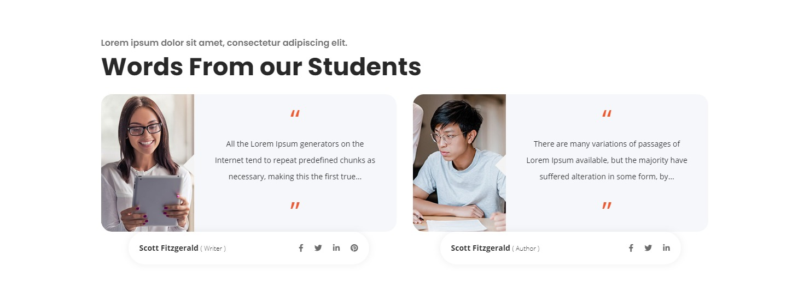

# Elements Description

**In this document, you will find some guides about the elements provided by Skille WordPress Theme**

### 1. Skille About us: Elementor Element

The about us element provide full control to add an eye catching section on your page

- You can control heading and sub headings
- About content
- Image and button links
- Counters, we recommend to use 4 counters to meet the design
- Add the counter image
- Select the background color
- Set the counter number
- Align the image to the left or right

### 2. Skille - Content Box

The content box allow you to add an image with content and action button. These can be manages left / right, right / left or centered

### 3. Skille - Blog Posts

The blog posts Element provides the way to show the blog posts. You can display the posts in three ways:

- List view
- Grid view
- Post view

### 4. Contact Form 7

You can add the contact form 7 directly into the Elementor edit screen by selecting the CF7 from the dropdown.

### 5. Counter

You can choose from multiple design layouts. Change the design by changing the colors, images, backgrounds, title and more

### 6. Events Posts

You can create a elegant yet responsive news and events section with elementor.
_Note:_ Do create events in the WordPress dashboard

### 7. Features

Features section is very handy if you want to put some features on. You can add as many features as you want. It supports image, title, description and a link.

### 8. Latest Blog Posts

It is a uniquely designed section to display the latest blog post from easy category.
You can select 1 blog post from easy category and it will be displayed accordingly.

### 9. Filterable Products

Filterable products element allows you to display products that are filterable with the catalog name. You can choose between three different navigation styles and 2 products so you can pick according to your requirement.

### 10. Icon Box

Icon box is a tiny element with lots of control. You can choose between icons and images. Align the content, modify the spacing according to your requirements, and lot more.

### 11. Newsletter Subscription

The newsletter subscription element allows you to create a nice subscription section with heading, subhead and allows you to put a shortcode of any form.

### 12. Section Headings

The standard Skille WordPress Theme heading styling is available separately so you can put it whereever you want and control the heading, subheading, text and button according to your need

### 13. Social Icons

Easily add the social icons with the elegant design available with the Skille WordPress Theme

### 14. Staff Members

This Elementor element allow you to add the staff members featured with 3 different designs to pick from. Allows you to present your team at a glance.

### 15. Testimonial Carousel

Testimonial carousel is an essential element, allows you to display the testimonials with 2 unique designs.

