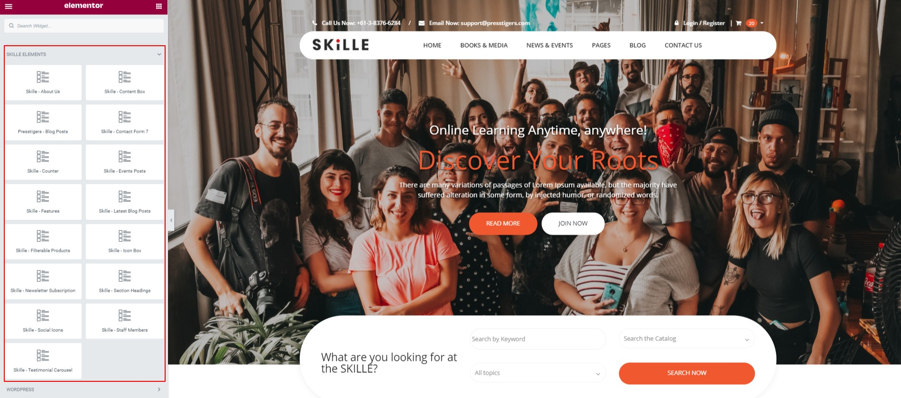

# Elementor Guide

Skille WordPress Theme is fully supported with Elementor and Elementor Pro. Skille Provides 15 additional easy to use Elementor Elements to build your website. These elements can be found on the Elementor page builder > under Skille tab.

Skille Elements are as follows:

- [Skille - About Us](/elementor/elements-description.md#_1-skille-about-us-elementor-element)
- [Skille - Content Box](/elementor/elements-description.md#_2-skille-content-box)
- [Skille - Blog Posts](/elementor/elements-description.md#_3-skille-blog-posts)
- [Skille - Contact Form 7](/elementor/elements-description.md#_4-contact-form-7)
- [Skille - Counter](/elementor/elements-description.md#_5-counter)
- [Skille - Events Posts](/elementor/elements-description.md#_6-events-posts)
- [Skille - Features](/elementor/elements-description.md#_7-features)
- [Skille - Latest Blog Posts](/elementor/elements-description.md#_8-latest-blog-posts)
- [Skille - Filterable Products](/elementor/elements-description.md#_9-filterable-products)
- [Skille - Icon Box](/elementor/elements-description.md#_10-icon-box)
- [Skille - Newsletter Subscription](/elementor/elements-description.md#_11-newsletter-subscription)
- [Skille - Section Headings](/elementor/elements-description.md#_12-section-headings)
- [Skille - Social Icons](/elementor/elements-description.md#_13-social-icons)
- [Skille - Staff Members](/elementor/elements-description.md#_14-staff-members)
- [Skille - Testimonial Carousel](/elementor/elements-description.md#_15-testimonial-carousel)

