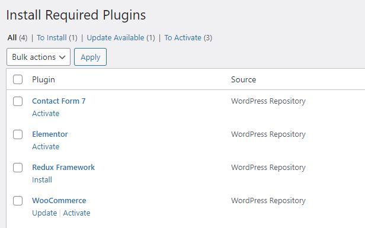

# Plugin Installation

After activating Skille WordPress Theme, you will see the following notice:

Click _Begin installing plugins_. By clicking this, you will be navigated to the Install Required Plugins page.

Simply check all of them (or all of the required plugins and some recommended plugins you like) and from the drop-down select Install, then hit Apply.

**Required plugins:**

- Elementor
- Redux

**Recommended plugins:**

- Contact Form 7
- WooCommerce
- YITH WooCommerce Wishlist
