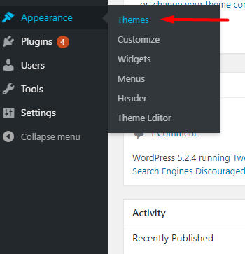
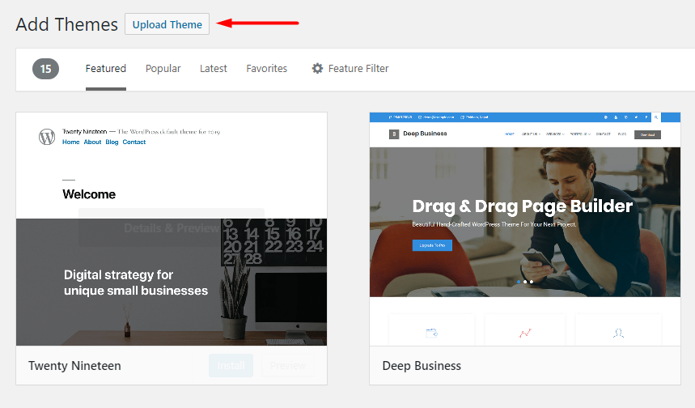
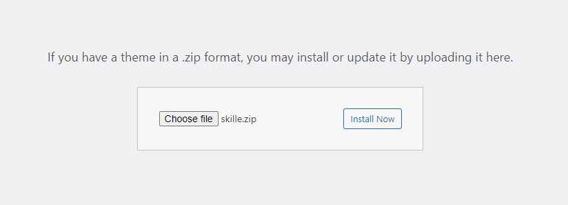
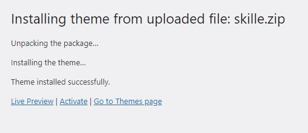

# Theme Installation

After purchasing Skille, please download the package from ThemeForest. All you need to do is moving your mouse over your login name at the right top corner – after you log in ThemeForest, and then click Downloads.

Here you will find all the items that you have purchased. Hover to Download button next to Skille, you will see these download options:

- Installable WordPress file only which you can upload when installing the theme
- All files & documentation (full zip folder). You will need to extract and locate the installable WordPress file to upload when installing the theme

![][logo]

[logo]: ../images/1.png "Skille WordPress Theme"

?> If you are updating your website theme from an older version then please make sure taking Backup of the complete website Files and the Database for any future reference.

## Install theme via WordPress

_Step 1:_ Navigate to _Appearance > Themes_

_Step 2:_ Click Add New, then click _Upload Theme > Choose File_

_Step 3:_ Browse to the _.zip_ file on your computer, then click _Install Now_

Step 4: When the installation completes, click Activate. You will be redirected to the Themes page with Skille activated.

## Install theme via FTP

- _Step 1:_ Unzip zip file package – the zip package is inside the skille.zip file. Folder you have downloaded from ThemeForest Skille.

- _Step 2:_ Connect to your FTP server and navigate to the folder where your WordPress is installed

- _Step 3:_ Go to wp-content/themes/ and upload theme folder (the path will look like this: wp-content/themes/skille)

- _Step 4:_ Open WordPress admin panel (navigate through the web-browser to the folder where you have installed the WordPress e.g www.yourdomain.com/wp-admin/) and go Appearance > Themes on admin sidebar. Activate Skille.
