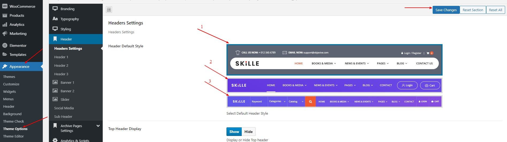

# How to change the navigation menu design

You can pick one of three menu items in the appearence theme options

- Go to the Appearence > Theme Options
- Go to the Header > Header Settings
- Choose 1 of 3 header styles
- Hit save

