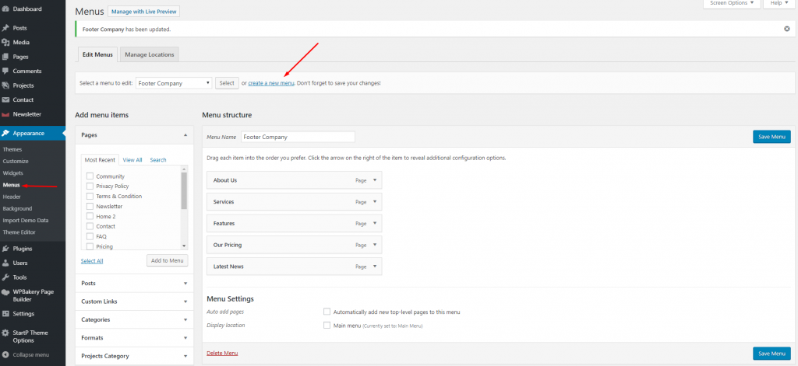
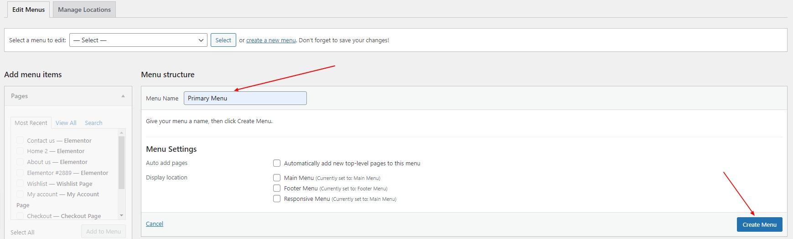
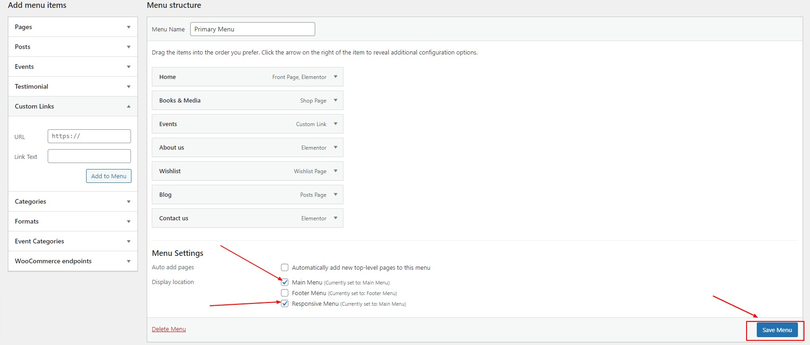

# How to create a Navigation Menu

- _Step 1:_ Navigate to Appearance > Menus in your admin sidebar and click Create a new menu option.

- _Step 2:_ Give your menu a name, then hit Create Menu.

- _Step 3:_ Choose menu items you want to add from the left and hit Add to Menu. Select main menu and Responsive Menu form settings and then hit Save Menu. Your new menu has been created.
  This menu will display now on main menu location and as responsive menu on smaller screen sizes.

