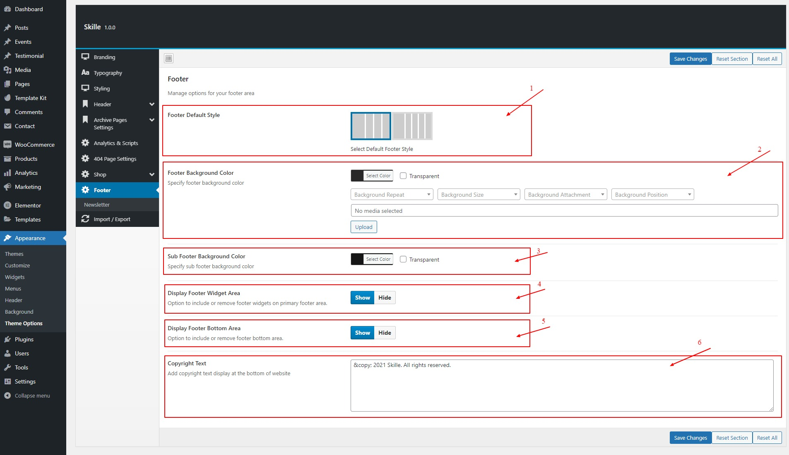
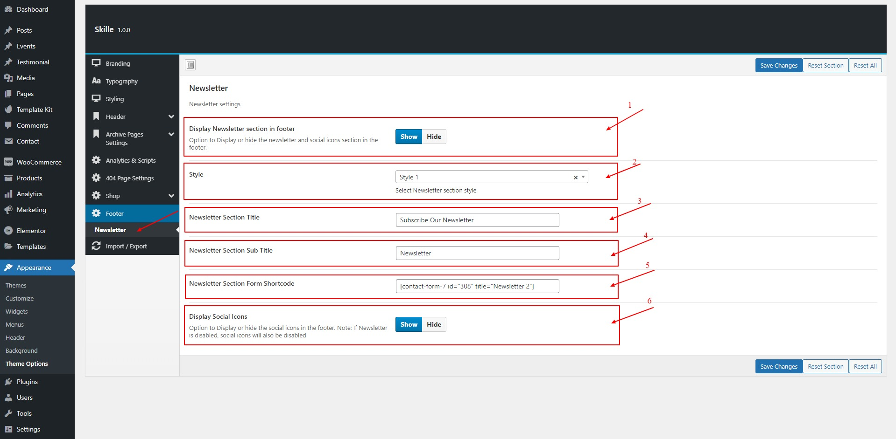

# Footer Settings

## Footer General Settings

#### Skille WordPress Theme provides control over the footer section of the theme. You can choose from variety of options to meet your needs.

1. _Footer Default Style_ Choose between 4 or 5 columns footer style
2. _Footer Background Color_ Choose the background color for the footer section
3. _Sub Footer Background Color_ Pick a background color for sub footer
4. _Display Footer Widget Area_ Whether display or hide the main footer section
5. _Display Footer Bottom Area_ Whether display or hide the lower (copyright) area of the footer
6. _Copyright Text_ Write the copyright test

## Footer Newsletter Settings

#### You can enable / edit newletter section with social media icons through this area

1. _Display Newsletter section in footer_ Enable / disable the newsletter section
2. _Style_ Choose between two design for the newsletter section
3. _Newsletter Section Title_ Give newsletter section a title
4. _Newsletter Section Sub Title_ Give newsletter section a sub title
5. _Newsletter Section Form Shortcode_ Put the shortcode for the newsletter e.g. Contact Form 7 Shortcode
6. _Display Social Icons_ Whether to display the social icons with the newsletter section or not.

