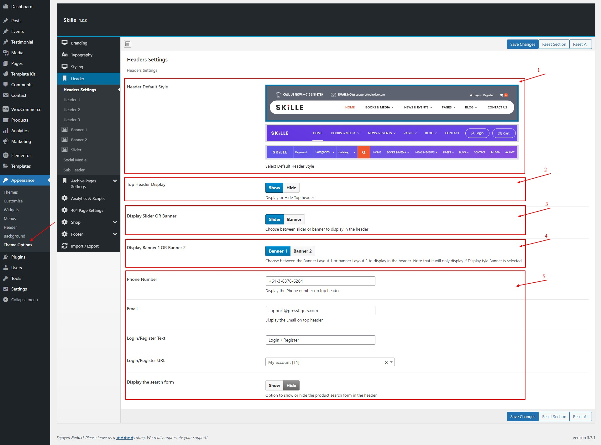
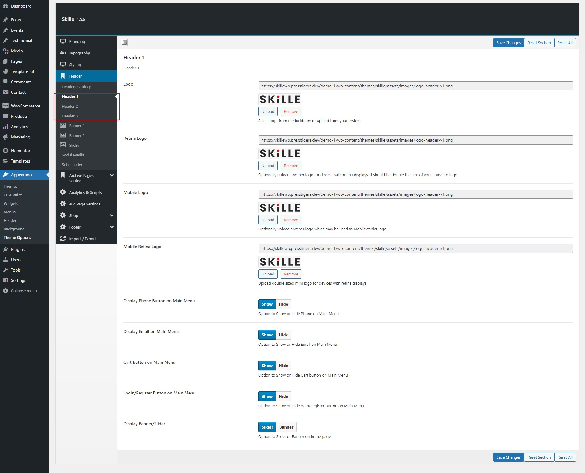
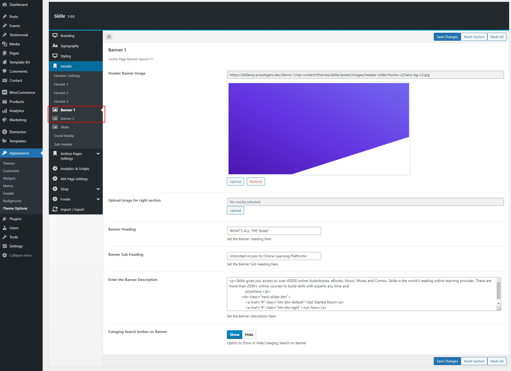
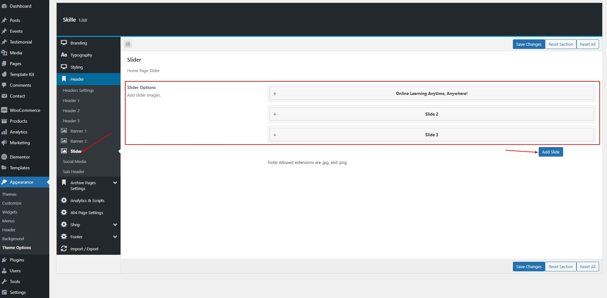
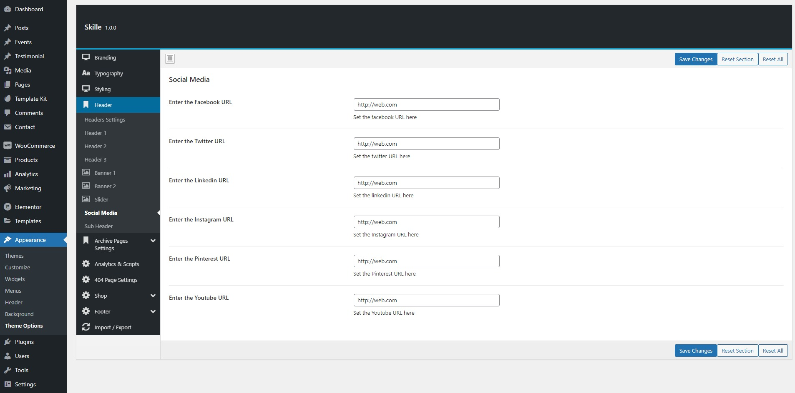

# Header Settings

## Header General Settings

#### Skille WordPress Theme provides maximum control over the header section of the theme. You can choose from variety of options to meet your needs.

1. _Header Default Style_ Choose a header menu from 3 different layouts available
2. _Top Header Display_ This allows you to enable or difable the top header as per your requirements.
   Note that this is only available for header 1.
3. _Display Slider OR Banner_ Choose between slider or banner on which will be displayed under the main menu.
   Skille WordPress Theme provides both slider and banners by it self.
4. _Display Banner 1 OR Banner 2_ Theme provides two banner styles that you can choose from. _you can choose anyone as per your requirements_
   Slider is associated with Theme template 1
   Banner 1 is associated with theme template 2
   Banner 2 is associated with theme template 3
5. Top bar settings:
   - _Phone Number_
   - _Email Address_
   - _Login / Register text_ Its your call to action, could be anything
   - _Login / Register URL_ The URL Link for call to action
   - _Display the Search Form_ Whether to display the search bar in the menu or not.

## Header Style Specific Settings

#### Skille WordPress theme provides header style related settings so you can have more control.

## Header Banner Settings

#### The Banner Style 1 and 2 can be controled through theme settings

## Header Slider Settings

#### The slider can be managed through these settings provided under slider menu

## Social Media Settings

#### You can add social media links here

