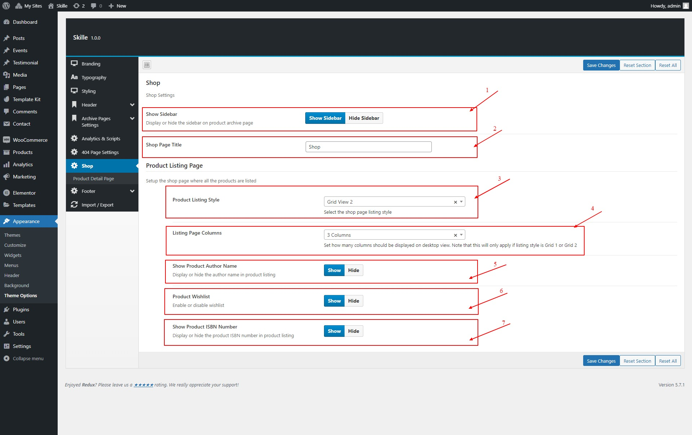
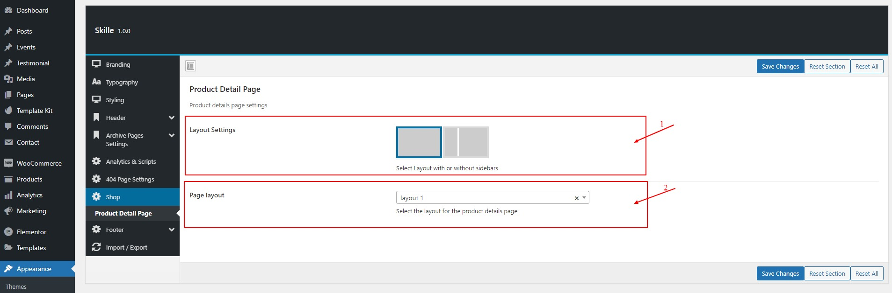

# Shop Settings

## Shop General Settings

#### Skille WordPress Theme provides control over the shop section of the theme. You can choose from variety of options to meet your needs.

1. _Show Sidebar_ Whether to enable / disable sidebar on the shop listing page
2. _Shop Page Title_ Page title of the shop page
3. _Product Listing Style_ Select the listing page layout from the drop down. There are 3 different layouts to choose from.
   - Grid View 1
   - Grid View 2
   - List View
4. _Listing Page Columns_ How many columns would you like to have on shop listing page. There are 3 different columns to choose from.
   - 2 Columns
   - 3 Columns
   - 4 Columns
5. _Show Product Author Name_ Show or hide the name of the author with the product
6. _Product Wishlist_ Enable or disable the wishlish
   Note: This feature is dependent on YITH WooCommerce Wishlist Plugin
7. _Show Product ISBN Number_ Show or hide the product ISBN number

## Product Detail Page Settings

#### Skille WordPress Theme provides control over the shop detail page of the theme.

1. _Layout Settings_ Choose to allow or disallow the sidebar on the product detail page
2. _Page layout_ Skille WordPress Theme provide 2 different product detail page layouts to choose from. Pick whichever you preffer.

