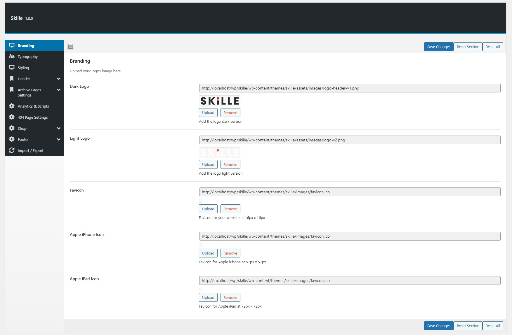

# Theme Options

Theme Options Are Global Settings That Affect The Entire Site.
This section will provide you an in-depth guide on how to use the Theme Settings.

You can control the theme’s functionality and customize the content from the Theme Options panel or directly from the WordPress Customizer. Here you will find all the relevant settings to customize the theme.

- To access the Theme Options panel, go to- Dashboard > Appearence > Theme Options.
- To access the THeme Customizer, go to- Dashboard > Appearence > Customizer.

